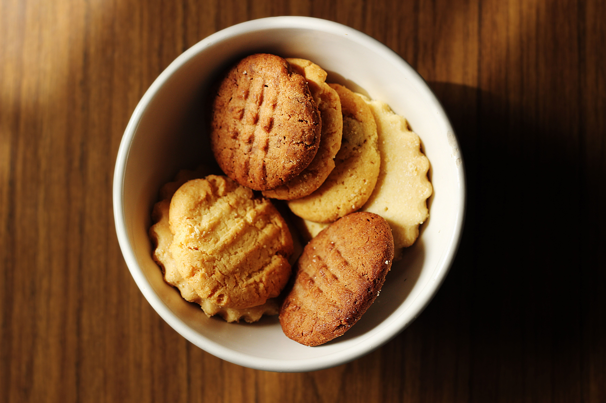

# curso de introduccion a la programacion
## modulo I html y css
### clase 1 introduccion a html
- Que es html, servidores, css
### clase 2 html - importar fuentes - iconos
- introduccion a css
### clase 3 a la introduccion a git 
1. Que es git 
2. Hacer mi primer commit 
3. Archivo readme 
4. Lenguanje markdown

[Google](https://www.google.com/)

